 

 

 
---
 
#### Languages
 

#### Frontend
 

 
#### DevOps & Infra
 

 

 
#### Databases & Tools
 

 

#### Design

 

 
 ---

#### Stats

  
  &nbsp;
  

  

---
 
#### Connect

  
  &nbsp;
  
  &nbsp;
  
  &nbsp;
  

