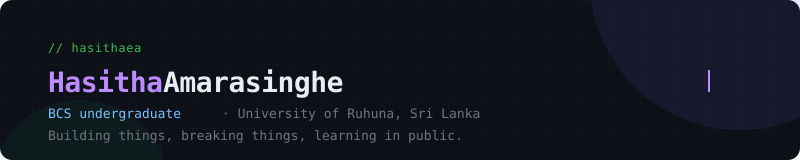

 

 

 
---

#### Languages

#### Frontend

#### Desktop Apps

#### DevOps & Cloud

#### Deployment & Hosting

#### Databases

#### Developer Tools

#### Design

 
---

#### Stats

&nbsp;

  

---
 
#### Connect

  
  
  
  
  
  

